# Morpheus OpenRouter LLM Plugin

An `LlmProvider` plugin for HPE Morpheus Enterprise 9.0 that adds **OpenRouter** as an AI integration
type under *Tools > AI Services > Integrations*, so Morpheus AI agents can use the models of every
vendor OpenRouter serves: OpenAI, Google, Mistral, DeepSeek, Qwen, xAI and many more, through
OpenRouter's OpenAI-compatible API.

> **Independent community project.** Not an official OpenRouter, Anthropic or HPE product, and
> neither endorsed by nor affiliated with any of them. See [Trademarks](#trademarks).

- **Claude models:** use [Anthropic Claude plugin](../anthropic/README.md).
  It talks to OpenRouter's Anthropic-compatible endpoint and keeps prompt caching of the MCP tool
  catalog and Anthropic's server tools. This plugin hides Anthropic models by default.
- **Why not the Local LLM plugin's "OpenAI Compatible" integration?** Version 1.0.0 cannot connect
  to OpenRouter or `api.openai.com`: it sends no SNI in the TLS handshake. See
  [docs/hpe/hpe-bug-report-local-llm-sni.md](../../docs/hpe/hpe-bug-report-local-llm-sni.md).

## What it does

| Capability | Status |
|---|---|
| Chat completions and streaming | yes |
| Tool use / function calling (MCP) | yes — OpenAI format, passed through |
| Model catalog sync | yes — only models an agent can use, with an optional allow list |
| Key check on save | yes — `GET /api/v1/key`, since the model list answers any key |
| Cost visible in chat | yes — optional footer with the cost of the whole question |
| Errors visible in chat | yes — OpenRouter's message and what to do, instead of Morpheus' generic error |
| Empty tool arguments | dropped before Morpheus runs the tool — optional, on by default |
| Cut-off answers | say so |
| Rate limits | waited out twice before a question fails |
| Reasoning effort | optional — low, medium or high; reasoning never shown in the answer |
| In-region routing (EU, US) | yes — with OpenRouter's Business or Enterprise plan |
| Outbound proxy | yes — select a Morpheus network proxy per integration |
| Form translations | English, German, Polish |
| Embeddings | no |

---

## Quick start

### Prerequisites

- **HPE Morpheus Enterprise 9.0.0 or newer.** Built and tested on 9.0.1, which ships plugin API
  1.4.1; 9.0.2 ships the same API version.
- **Outbound HTTPS from the appliance to `openrouter.ai:443`**, directly or through a Morpheus
  network proxy. The appliance makes the calls, not your browser.
- **An OpenRouter account with credits** and an API key (`sk-or-v1-...`, created under *Keys* in
  the OpenRouter settings). A dedicated key per appliance, with a credit limit, keeps a looping
  agent from spending more than you intend.

### 1. Install the plugin

Download `morpheus-openrouter-plugin-<version>-all.jar` from the
[latest release](https://github.com/tgessendorfer/hpe-morpheus-ent-plugins/releases/tag/openrouter-v0.2.0) and upload it under *Administration > Integrations >
Plugins > Add*. The plugin registers two providers: `LLM OpenRouter` and `OPTION OpenRouter Options`.

### 2. Create the integration

*Tools > AI Services > Integrations > + New Integration > OpenRouter*:

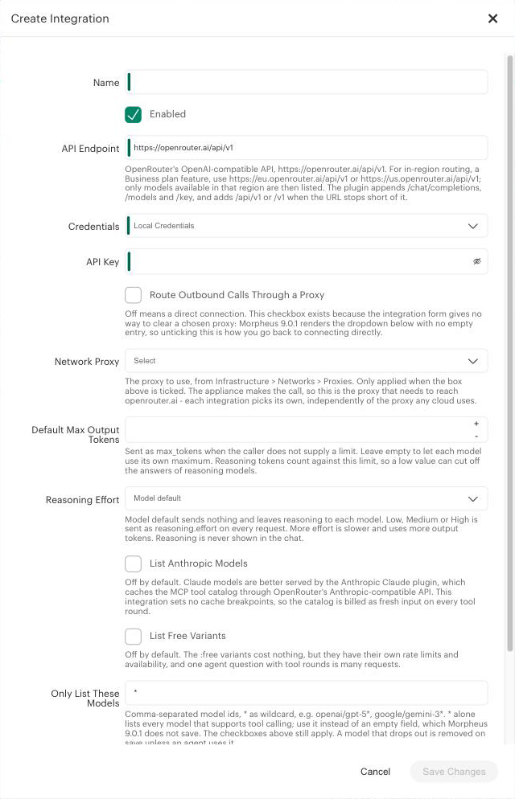

| Field | Value |
|---|---|
| **API Endpoint** | `https://openrouter.ai/api/v1`. `https://openrouter.ai` and `https://openrouter.ai/api` are completed to `/api/v1`. For [in-region routing](#in-region-routing-eu-and-us), `https://eu.openrouter.ai/api/v1` or `https://us.openrouter.ai/api/v1` |
| **Credentials** | *Local Credentials* with the key below, or an *API Key* credential from *Infrastructure > Trust > Credentials* (a 73-character OpenRouter key fits there) |
| **Route Outbound Calls Through a Proxy** | off means a direct connection; see [Network proxy](#network-proxy) |
| **Network Proxy** | the proxy to use when the box above is ticked |
| **Default Max Output Tokens** | leave empty to let each model use its own maximum. Reasoning tokens count against a limit set here |
| **Reasoning Effort** | *Model default* sends nothing; see [Reasoning](#reasoning) |
| **List Anthropic Models** | off; Claude belongs in the Anthropic plugin |
| **List Free Variants** | off; see [Which models are listed](#which-models-are-listed) |
| **Only List These Models** | `*` lists every model; see [Allow list](#allow-list) |
| **Append Cost to Answers** | optional; see [Cost footer](#cost-footer) |
| **Show OpenRouter Errors in Chat** | on; see [Errors in the chat](#errors-in-the-chat) |
| **Drop Empty Tool Arguments** | on; see [Empty tool arguments](#empty-tool-arguments) |

**Save.** The plugin checks the key with `GET /api/v1/key`, loads the model list, and on a
regional domain checks that in-region routing is enabled. A rejected save shows the reason in the
form:

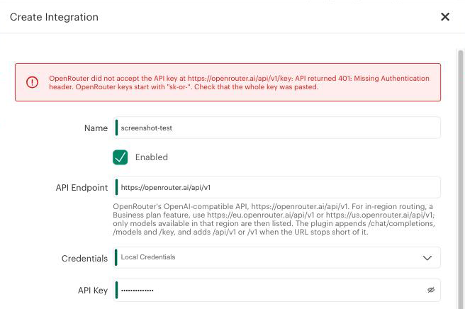

A healthy integration reports status `ok` and its model count:


The form follows the viewer's *Default Locale* in *User Settings* — English, German and Polish:

| German | Polish |
|---|---|
| 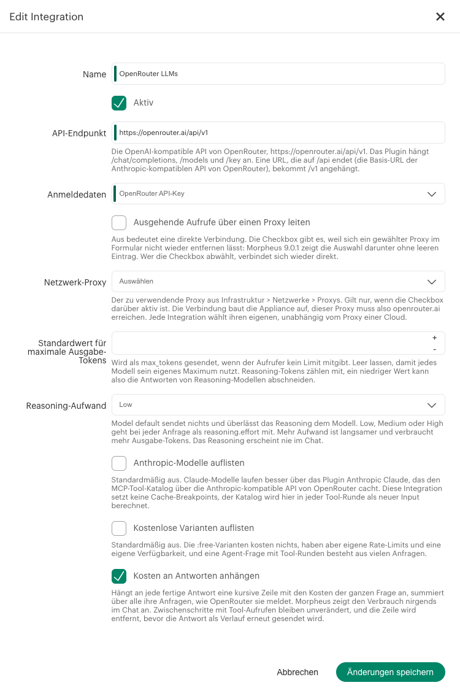 | 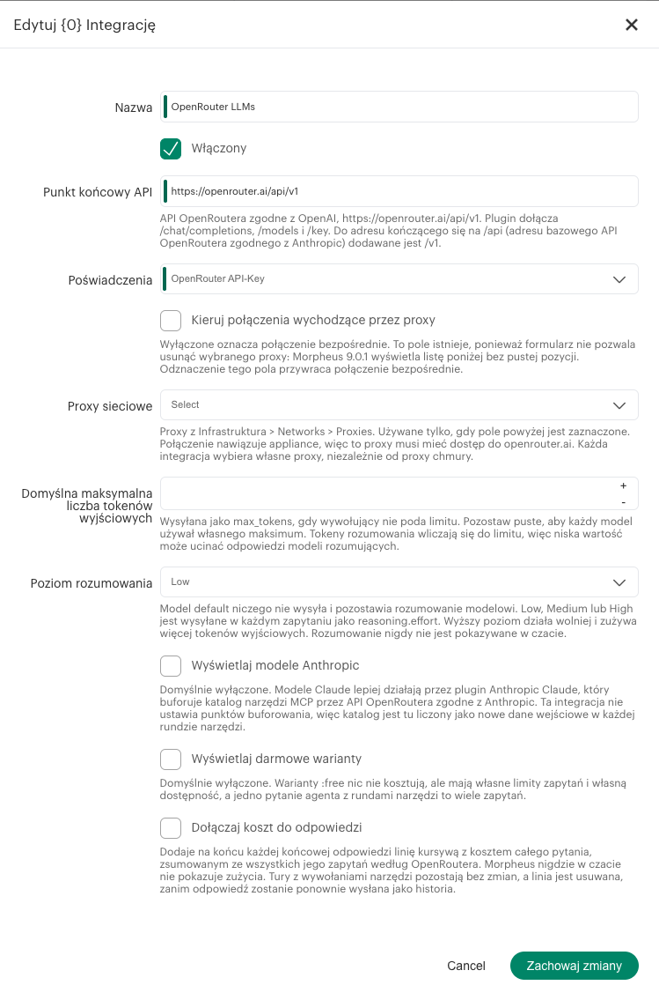 |

### 3. Build an agent

*Tools > AI Services > Agents > Create Agent*: pick the integration and a model, and attach the
built-in **Morpheus** MCP server. Leave **Read-only mode** on for a first run: the built-in MCP
server also offers tools that change or delete infrastructure.

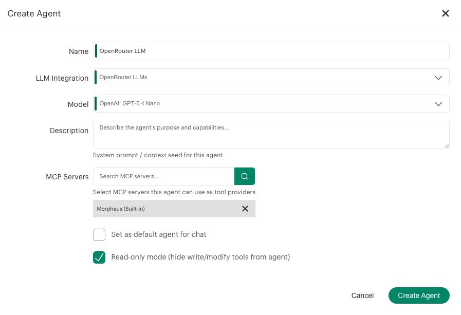

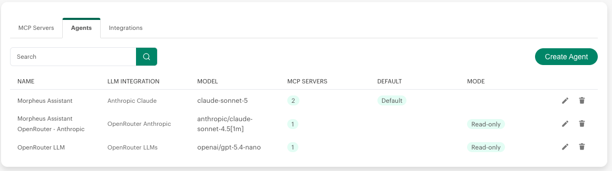

The chat's agent picker loads its list with the page — reload the page if a new agent is missing.

---

## Which models are listed

OpenRouter's catalog held 445 models on 2026-09-15. The plugin lists a model only when

- it supports tool calling (`tools` in `supported_parameters`) — agents work through MCP tools;
- it outputs text only — no image or audio generation;
- it is neither a router (`openrouter/*`, which picks the model per request) nor an alias
  (`~vendor/...-latest`, which switches models under a running agent);
- it is not a `:batch` variant (served by OpenRouter's Batch API only);
- it is not an Anthropic model, unless **List Anthropic Models** is ticked;
- it is not a `:free` variant, unless **List Free Variants** is ticked. Free variants cost nothing
  but have their own rate limits, and one agent question with tool rounds is many requests;
- it has not passed its expiration date. A model that goes away within a year says so in its name.

That left **244 models** on 2026-09-15. Names keep OpenRouter's vendor prefix, such as
*OpenAI: GPT-5.5* or *Google: Gemini 3.5 Flash*.

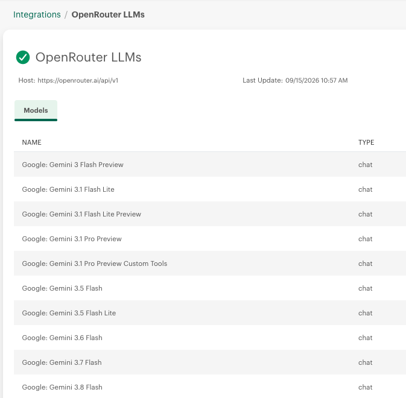

### Allow list

The model tab of an integration has no search box, and with several hundred models the agent form
gets long. **Only List These Models** narrows the list to the models you actually use:

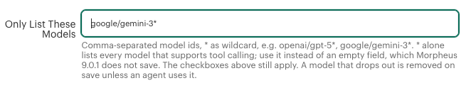

- Comma-separated model ids, `*` as wildcard, case-insensitive, matching the whole id:
  `openai/gpt-5*, google/gemini-3*, deepseek/deepseek-v4-flash-0731`.
- It only narrows. It never brings back a model the rules above leave out.
- **`*` lists every model, and it is the default.** Morpheus 9.0.1 does not save a text field that
  is emptied on edit — the form puts the old value back — so enter `*` instead of clearing the field.
- An allow list that matches no model at all is ignored, with a warning in the log, instead of
  emptying the integration.

### When a model drops out

Saving the integration refreshes the list. A model that is no longer listed — dropped by
OpenRouter, or filtered out by a changed setting — is **removed**, because Morpheus 9.0.1 offers
disabled models in the agent form like enabled ones. A model that an agent still uses cannot be
removed; it stays **disabled** until it is listed again, and the log names it. Each refresh logs
one line:

```
OpenRouter model sync for integration 4: 36 listed, 0 added, 0 updated, 211 removed, 0 disabled because an agent still uses them
```

---

## Reasoning

Many models reason before they answer. **Reasoning Effort** decides what the plugin asks for:

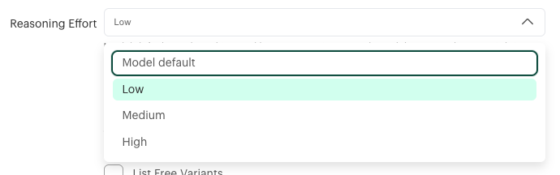

- **Model default** sends no `reasoning` parameter; each model does what it does by default. Some
  models always reason.
- **Low**, **Medium** or **High** is sent as `reasoning.effort` on every request. More effort is
  slower and costs more output tokens.

Reasoning text is never put into the answer or the stream. The appliance log shows the reasoning
token count of every request.

## Cost footer

Morpheus shows no token or cost figures in the chat. With **Append Cost to Answers** ticked, each
final answer ends with the cost of the whole question, as OpenRouter reports it, summed over all of
its requests — an agent question with tool rounds is many billed requests:

> *Kosten: $0.0070 (7 Anfragen)*

The label follows the language of the answer (English, German, Polish). Tool-call turns get no
footer, and footers are removed from answers before they are replayed as history, so a model
never learns to write its own.

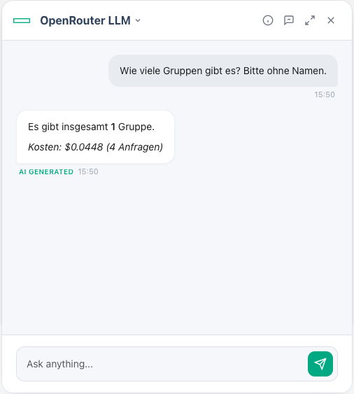

### Prompt caching

The plugin sets no cache breakpoints. Providers that cache on their own still do: with OpenAI
models, the MCP tool catalog came from OpenAI's cache from the third request of a question on,
at about a third of the price. Claude needs explicit breakpoints — another reason to use the
Anthropic plugin for Claude.

### Every request in the log

```bash
grep OpenRouter /var/log/morpheus/morpheus-ui/current
```

```
OpenRouter request: model=openai/gpt-5.4-nano messages=2 tools=68 max_tokens=1000 temperature=0.7 reasoning=null stream=false
OpenRouter tool calls: use_servers_tools {"filter":"list_servers"}
OpenRouter usage: model=openai/gpt-5.4-nano provider=OpenAI input=10775 cached=9728 output=212 reasoning=89 cost=0.00066896
```

The request line shows the shape of every request, never its content. A question answered without
a `tool calls` line did not use MCP data.

## Empty tool arguments

Some models fill every optional parameter of a tool call with an empty value, and Morpheus' built-in
MCP tools take `""`, `0` and `false` as filters: `list_servers` with `status: ""` or `zoneId: 0`
finds nothing, while `list_servers` without arguments lists every server. Seen with
`openai/gpt-5.4-nano` and `openai/gpt-5.4-mini` (every one of 20 parameters filled in, answer *No
servers were found*).

With **Drop Empty Tool Arguments** on, the default — also for existing integrations — the plugin
removes top-level arguments whose value is `""`, `0`, `false`, `null`, `[]` or `{}` from the
model's tool calls before Morpheus runs the tool, which is the same as the model leaving them out.
The log names what was dropped:

```
OpenRouter tool calls: list_servers {"name":"","phrase":"","zoneId":0,"siteId":0,"managed":false,...}
OpenRouter dropped empty arguments from list_servers: name, phrase, zoneId, siteId, managed, ...
```

Untick it to forward tool calls exactly as the model wrote them.

## Cut-off answers

Morpheus asks for 1000 output tokens on every chat request. An answer that hits that limit — or
**Default Max Output Tokens** — ends mid-sentence, and the chat gives no sign of it. The plugin
appends a line, *Answer cut off at the output token limit.*, in the language of the answer, and
shows only that line when there was no text at all, as with a reasoning model that spent the whole
budget thinking. The line is removed before the answer is replayed as history.

## Errors in the chat

Morpheus replaces every error a provider reports with a text of its own — *The AI model is no
longer available*, *An error occurred while processing your request* — which says nothing about
the cause. With **Show OpenRouter Errors in Chat** ticked, the default, the plugin answers a failed
question itself, with OpenRouter's message and what to do about it:

> **OpenRouter-Fehler 429:** Rate limit exceeded: new-account-rpm/google/gemini-3.5-flash-20260519. Rate limit reached: new accounts are limited to 20 requests per minute for this model. Please retry shortly.
>
> Zu viele Anfragen in kurzer Zeit. Eine Minute warten und erneut fragen.

- The heading carries the HTTP status; the advice covers 400, 401, 402, 403, 404, 408, 429 and
  the 5xx errors. Both follow the language of the question (English, German, Polish).
- With the cost footer on, the answer ends with what the question cost until it failed.
- Text a stream had already shown stays above the error.
- Error answers are left out when the conversation is replayed to the model.
- **Before a question fails, a rate limit (`429`) or an overloaded provider (`503`) is waited out
  twice**, 10 and then 20 seconds, or as long as a stream's `Retry-After` asks, up to 30 seconds.
  A stream that has already shown text is not retried, since that would repeat it.

Unticked, the plugin reports the error to Morpheus as before. Every failure is in the log either
way: `grep 'OpenRouter chat completion failed' /var/log/morpheus/morpheus-ui/current`.

---

## In-region routing (EU and US)

OpenRouter routes requests sent to `https://eu.openrouter.ai/api/v1` or
`https://us.openrouter.ai/api/v1` only to provider endpoints in that region, with the same key and
model ids. The model list there contains only eligible models.

In-region routing needs OpenRouter's **Business or Enterprise plan**, chosen by an organization admin
under *Settings > Preferences > Account Type* on openrouter.ai. Business is self-serve: an upgrade by
credit card, without a contract or enterprise sales. Without it, OpenRouter still accepts
the key check and serves the model list, but refuses every chat request. The plugin therefore sends
one request for a model that cannot exist when you save an integration against a regional domain:
without the plan it comes back refused, and the save fails with an explanation; with the plan it
comes back as an invalid model, and nothing runs.

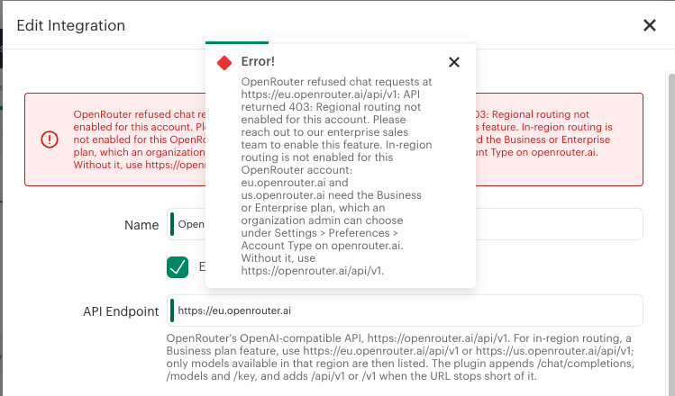

## Network proxy

Morpheus keeps proxies under *Infrastructure > Networks > Proxies*. **Route Outbound Calls Through a
Proxy** is the switch and **Network Proxy** the choice. The checkbox exists because Morpheus 9.0.1
renders the proxy dropdown without an empty entry: a chosen proxy can be changed, never removed, and
unticking the box is how you go back to a direct connection. The proxy applies to every call the
plugin makes — the key check, the model sync and the chat.

## Sampling parameters

Morpheus sends a `temperature` with every chat request. The plugin forwards `temperature`, `top_p`
and stop sequences unchanged; OpenRouter drops the parameters a model does not support.

---

## Troubleshooting

| Symptom | Cause and fix |
|---|---|
| The chat says **"The AI model is no longer available"** | Morpheus shows most provider errors this way. Tick **Show OpenRouter Errors in Chat** to see OpenRouter's message instead; the real reason is also in the appliance log: `grep OpenRouter /var/log/morpheus/morpheus-ui/current`. |
| Save fails with `401: Missing Authentication header. OpenRouter keys start with "sk-or-"` | OpenRouter's answer to a key in the wrong format, although the header was sent. Paste the whole `sk-or-v1-...` key. |
| Save fails with `401: User not found.` | The key is unknown to OpenRouter: mistyped, revoked or deleted. |
| Chat fails with `402` | The OpenRouter account or the key's limit has no credits left. |
| Save or chat fails with `403: Regional routing not enabled for this account` | `eu.openrouter.ai` and `us.openrouter.ai` need the Business or Enterprise plan. Use `https://openrouter.ai/api/v1` otherwise. |
| Save fails with `... returned no model list` | The API endpoint points at a web page. Use `https://openrouter.ai/api/v1`. |
| **Only List These Models** cannot be emptied | Morpheus 9.0.1 puts the old value back into an emptied field. Enter `*`. |
| Switching from a stored credential to *Local Credentials* is not saved | Morpheus 9.0.1 keeps the stored credential on edit. Change the key inside that credential under *Infrastructure > Trust > Credentials*, or create a new integration and point the agents at it. |
| The log says `Only List These Models '...' matches none of N models and is ignored` | A typo in the allow list. The list stays complete until it is fixed. |
| An agent fails after the model list was narrowed | Its model is disabled because it is no longer listed. The log names it. List it again, or give the agent another model. |
| The model tab has no search | Not available to plugins on 9.0.1. Use the allow list. Reported to HPE: [docs/hpe/hpe-feature-request-llm-model-search.md](../../docs/hpe/hpe-feature-request-llm-model-search.md). |
| An agent answers **"0"**, "none" or "No servers were found" although the objects exist | The model filled optional tool parameters with empty values. **Drop Empty Tool Arguments** is on by default since 0.2.0; the log shows `OpenRouter dropped empty arguments from ...`. If it is unticked, tick it or use another model. |
| The chat says **"An error occurred while processing your request"** and the conversation is gone | Morpheus' text for a failed question, with **Show OpenRouter Errors in Chat** unticked or before 0.1.1. Look for `429` in the log: OpenRouter limits new accounts to 20 requests per minute per model (`new-account-rpm`), and one question with many tool rounds can exceed that. Wait a minute and ask again. |
| The chat shows **"OpenRouter error 429"** | The rate limit above lasted through both waits. Wait a minute and ask again, or ask a narrower question that needs fewer tool rounds. |
| An agent calls `get_result_excerpt` over and over | The built-in MCP tools return a large result truncated, as a preview with an artifact id, and a model can page through the artifact piece by piece. Seen with `google/gemini-3.5-flash` on a server list: 19 excerpt calls, 22 requests in 40 seconds, then the rate limit above. Ask a narrower question. |
| An agent says it cannot count instances: *"Looks like the server threw a gasket"* | Morpheus defect, not the plugin: `GET /api/instances` fails with `duplicate association path: containers.server` when the MCP tool `list_instances` is called with `agentInstalled` together with `serverId` or `hostId`. Each filter alone works. Smaller models pick that combination. |
| An answer looks invented | Check for `OpenRouter tool calls` in the log. Smaller models sometimes answer from the example values in the MCP tool descriptions (`delegate_to_specialist`) instead of calling a tool. |
| A new agent is missing from the chat's agent picker | The picker loads its list with the page. Reload the page. |
| The Polish dialog title reads *Edytuj {0} Integrację* | Morpheus' own Polish text; it affects every integration. |

The problems of Morpheus' own integration form are described for HPE in
[docs/hpe/hpe-bug-report-integration-edit.md](../../docs/hpe/hpe-bug-report-integration-edit.md).

## Version compatibility

| | |
|---|---|
| Minimum appliance | 9.0.0 (`Morpheus-Min-Appliance-Version`) |
| Tested on | HPE Morpheus Enterprise 9.0.1 (plugin API 1.4.1) |
| Built against | `morpheus-plugin-api` 1.4.2; the HTTP client tests also run against 1.4.1 |

## Build from source

Requires JDK 17 (**not 21** — Groovy 3.0.9) and the bundled Gradle wrapper. Run it in `llm/openrouter`.

```bash
./gradlew clean test shadowJar
# -> build/libs/morpheus-openrouter-plugin-<version>-all.jar
./gradlew test --tests '*ApiServiceSpec*' -PmorpheusPluginApiVersion=1.4.1
```

## Relationship to other plugins

| Use case | Plugin |
|---|---|
| Claude, with prompt caching and Anthropic's web search — direct or through OpenRouter | [Anthropic Claude plugin](../anthropic/README.md) |
| Every other OpenRouter model | this plugin |
| Ollama, vLLM, LM Studio or llama.cpp on your own network | HPE's Local LLM plugin |

## Attribution

Derived from the Apache 2.0 licensed
[HewlettPackard/morpheus-copilot-plugin](https://github.com/HewlettPackard/morpheus-copilot-plugin)
(structure, Gradle setup, session-scoped HTTP client pattern). See [NOTICE](NOTICE).

### Trademarks

"OpenRouter" is a trademark of its owner; "Anthropic" and "Claude" are trademarks of Anthropic PBC;
"HPE", "Hewlett Packard Enterprise" and "Morpheus" are trademarks of Hewlett Packard Enterprise.
Other model and vendor names are trademarks of their respective owners. They are used here solely to
identify the services this plugin integrates with. The icon in `src/assets/images/` is original
artwork, not an OpenRouter brand asset.

## License

[Apache License 2.0](LICENSE)
